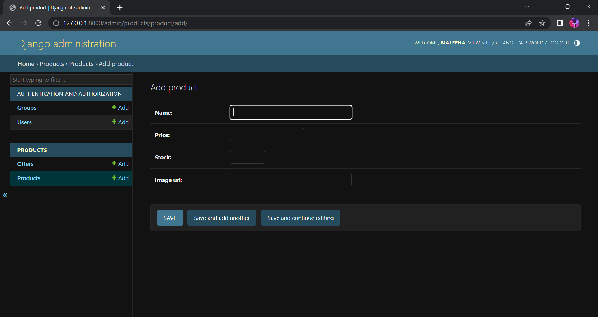

# PyShop-EcommerceWebsite
PyShop is an online Python Ecommerce website built with Django, SQLite and Bootstrap. A simple and lightweight ecommerce app easily deployable anywhere anytime with modules developed upon the inbuilt django admin.

Screenshots/ProductsPage.png

Screenshots/AdminHomePage.png

Screenshots/AdminProdPage.png

Screenshots/ManageUsersPage.png

***

## Get Started
To setup the PyShop project, here is the following guidelines:
* Clone the repository <code>git clone https://github.com/Naaz137/PyShop-EcommerceWebsite.git</code>
* Open Project folder on terminal 
* Prepare your virtual environment <code>python -m venv venv</code> 
* Activate your virtual environment <code>source env/bin/activate</code>
* Install your requirements.txt file <code>pip install -r requirements.txt</code>
* Create migrations using <code>python manage.py makemigrations</code> 
* Run migrations <code>python manage.py migrate</code>
* Start your dev server with <code>python manage.py runserver</code>
* Visit your App using <code>http://127.0.0.1:8000/</code>
* Create super user to access admin dashboard using <code> python manage.py createsuperuser</code>
* Follow the prompts after <code>Username: , Email address: , Password: , Password (again): </code>
* Visit Admin Page using <code>http://127.0.0.1:8000/admin</code> and login with the credentials created above.
* Add Products under the <b>Products</b> Menu, Add Offers also.
* Visit Products Page using <code>http://127.0.0.1:8000/products/</code>
